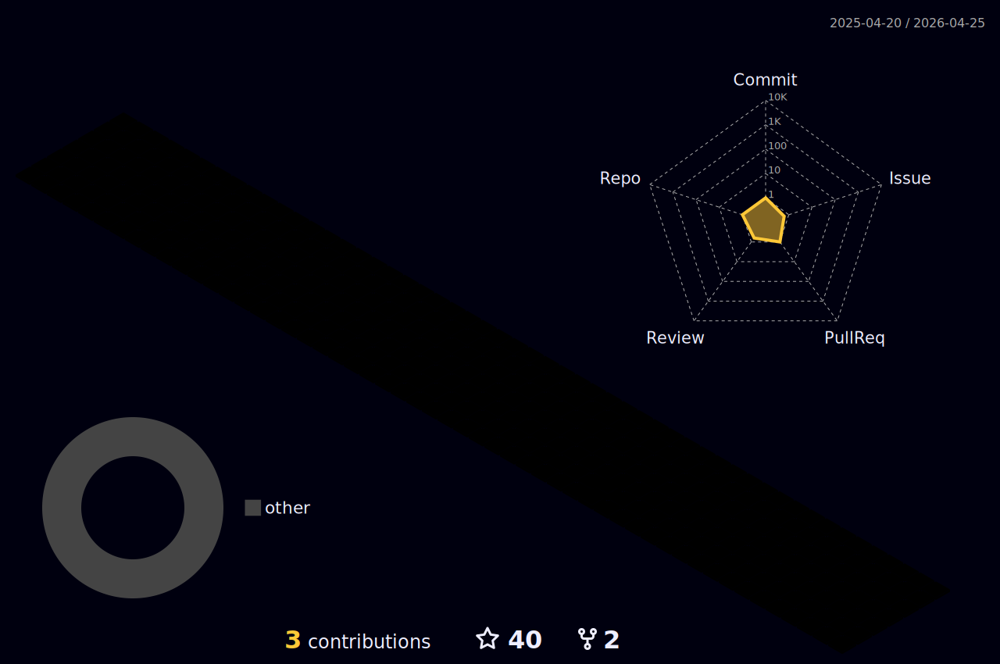

<h1>Luck = [Doing Things] * [Telling People]  </h1>

### :man_technologist: I'm 4-Leafs-Code and I'm interested in Web and Software development. 
### I'm also Clover Baxter and a Prisoner at Maine Correctional Center in Maine, U.S.A.

I've come to realize that I am an incredible force. Being a prisoner and accomplishing all I do verifies my ability to get things done when the need arises. I'm released anytime between now and March of 2025 depending on the circumstances of my release. I can work remotely in this facility and if you are interested in hiring me, please reach out to me or my current housing facility.    

🔭  I’m currently working on building and deploying a networking site for Maine prisoner    
reentry resource advocates to be able to connect and collaborate. I'm looking for some help    
building the site if you are interested check out the [Reentry Repo](https://github.com/4-Leafs-Code/Reentry).

I am the owner of [FearlessTech](https://github.com/FearlessTech), a Computer Technology student and I have a Mentorship from [Project Reclass.](https://www.projectreclass.org/). 

 

 
 
<h2>.   Skills</h2>

  

<h2 align="center"> &nbsp; Views and Followers :eyes:</h2>

    

    

 
 :octocat: GitHub Statistics

 
 
 
  

  
  
 

 
 

