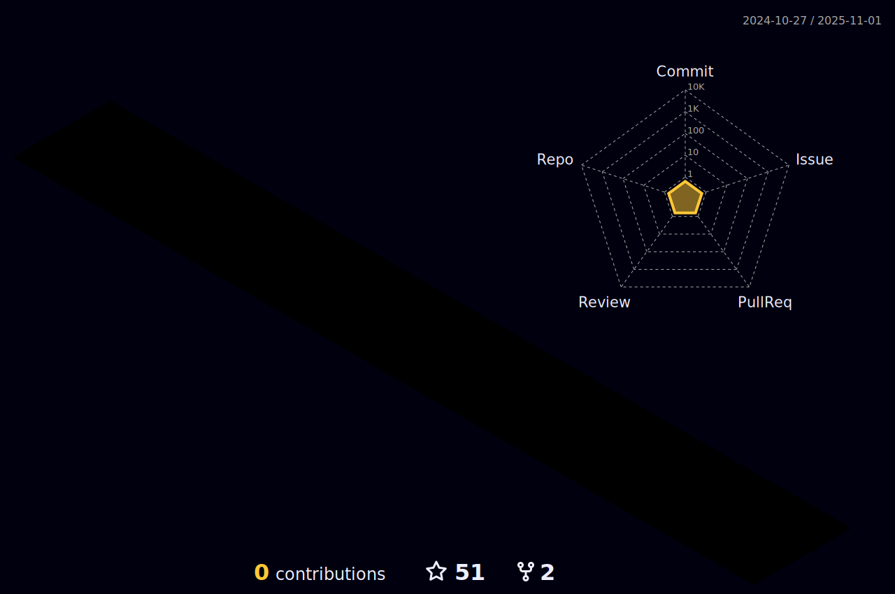

 
 
 

 
 

    

### Luck = [Doing Things] * [Telling People]   

  

### :man_technologist: I'm 4-Leafs-Code and I'm interested in Web and Software development.    
I am a Computer Technology student with a Mentorship from [Project Reclass](https://www.projectreclass.org/)

 
 

 
 
<h2>.   Skills</h2>

  

  
<b>:gear: &nbsp;Git statistics</b>

 
 
  

  
  
 

 
 
 

<!--
**4-Leafs-Code/4-Leafs-Code** is a ✨ _special_ ✨ repository because its `README.md` (this file) appears on your GitHub profile.

Here are some ideas to get you started:

- 🔭 I’m currently working on ...
- 🌱 I’m currently learning ...
- 👯 I’m looking to collaborate on ...
- 🤔 I’m looking for help with ...
- 💬 Ask me about ...
- 📫 How to reach me: ...
- 😄 Pronouns: ...
- ⚡ Fun fact: ...
-->
